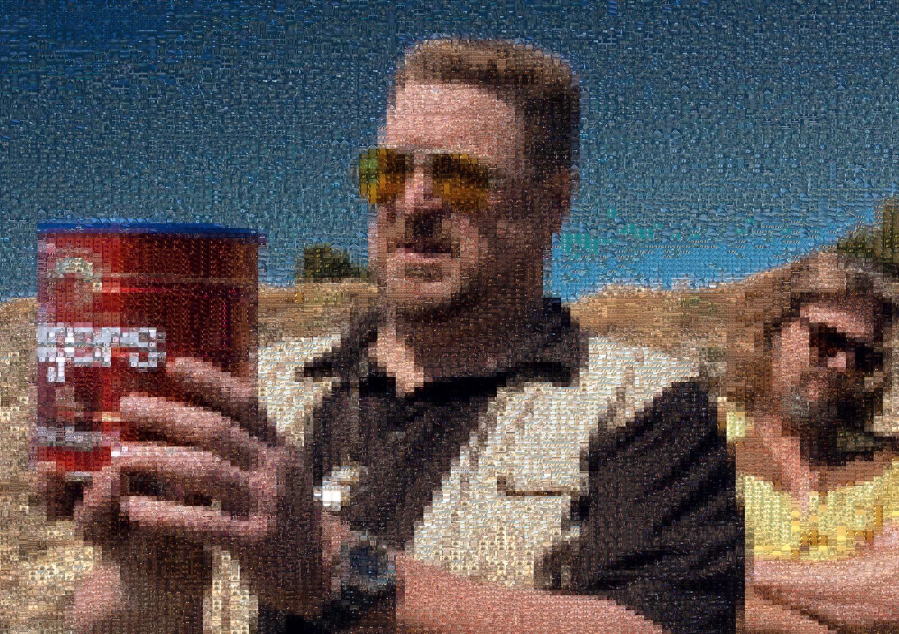

# image-generator

Turn a movie into a photo-mosaic poster of your favourite still — every tile of
the picture is a frame from the film, color-matched to the original image.

The tool samples frames across a movie, measures each frame's average color, and
then solves a min-cost matching so that every cell of a target image is filled
with the movie frame whose color is closest. The result is a large poster of the
target image rendered entirely out of the movie's own frames. Hang your
favourite movie on your wall :)



> A poster built entirely from frames of *The Big Lebowski* — zoom in and every
> tile is a still from the film.

## How it works

1. **Crop & blur the target** — the target is cropped to the output (A3) region,
   then divided into a grid of *frame-shaped* cells; each cell's mean color is
   recorded.
2. **Sample frames** — one frame per second of runtime is grabbed from the
   movie, shuffled, and cached.
3. **Measure frame colors** — each frame's average RGB is computed (and cached
   to a CSV).
4. **Match** — a min-cost-flow solver assigns a frame to every cell, minimising
   total color distance while limiting how often any frame is reused. Each cell
   is only connected to its closest frames in color space (a KD-tree k-nearest
   search) so the graph stays small and the solve stays fast.
5. **Render** — each chosen frame is placed *whole* into its cell — resized to
   the cell, never cropped or stretched (the cell already matches the frame's
   aspect ratio) — and optionally tinted toward the target color.

## Requirements

- Python 3.12+
- A movie file and a target image

## Installation

```bash
git clone --recurse-submodules https://github.com/shamir0xe/image-generator.git
cd image-generator
# if you already cloned without --recurse-submodules:
git submodule update --init --recursive

python -m venv .venv && source .venv/bin/activate
pip install -r requirements.txt
```

> The `pylib_0xe` dependency is vendored as a git submodule (`libs/PythonLibrary`),
> so the `--recurse-submodules` step is required.

## Configuration

Copy the sample env file and edit the values:

```bash
cp sample.env .env
```

`sample.env` documents every option inline. The most important ones:

| Variable | Meaning |
| --- | --- |
| `movie_path` | Folder containing your movie files |
| `image_path` | Default target image (override per-run with `--target-img`) |
| `movie_frames_path` | Where sampled frames are cached |
| `box` | Number of tiles along the counted axis (see `--by-width`/`--by-height`) — controls mosaic resolution |
| `frame_count_per_box` | Size of the frame pool sampled from the movie |
| `final_box_height` | Pixel size of each frame tile in the output |
| `upsample` | Upscale factor applied to the target before processing |
| `alpha` / `beta` | Color blend: `output = frame*alpha + target_color*beta` |
| `knn_ratio` | Fraction of nearest frames each cell may match (lower = faster, less memory; e.g. `0.1` = 10%) |
| `crop_box_x` / `crop_box_y` | Optional center-crop of sampled frames |

## Usage

The CLI is built with [Typer](https://typer.tiangolo.com/); run any command with
`--help` for details.

### Generate a poster

First run (extract frames from the movie, then build the poster):

```bash
python main.py gen --movie-name "Paris Texas" --movie-format mkv --generate-frames
```

On later runs the cached frames are reused — drop `--generate-frames`:

```bash
python main.py gen --movie-name "Paris Texas" --movie-format mkv
```

Useful options:

- `--target-img <path>` — render a specific target image.
- `--colored` — tint the frames toward the target colors (uses `alpha`/`beta`
  from `.env`). Without it, the raw, untinted movie frames are used.
- `--box <n>` — override the `.env` tile count for this run.
- `--by-width` / `--by-height` — count `box` tiles along the image's width or
  height (default `--by-height`). Use `--by-width` for a denser mosaic when the
  frames are wide.
- `--upsample <n>` — override the upscale factor.
- `--capacity <n>` — cap how many times any single frame may be reused (by
  default the best capacity is found automatically).

Output is written to `outputs/` — a full-resolution A3 poster and a downscaled
`-final` preview.

### Other commands

```bash
# Only sample frames from a movie (no poster)
python main.py sampling --movie-name "Paris Texas"

# Crop any image to A3 ratio and downscale it
python main.py crop --image-path path/to/image.jpg

# Clear the cached frames + color CSV for a movie
python main.py clear-cache --movie-name "Paris Texas"
```

## Caching notes

Frames and their measured colors are cached per movie under
`movie_frames_path/<movie>/` and `assets/<movie>-<frame_count_per_box>.csv`.

If you manually add or remove frames in a movie's frame folder, delete the
matching `assets/<movie>-*.csv` so the color cache is rebuilt — otherwise the
results will be inconsistent. When in doubt, run `clear-cache` and regenerate.

## License

[MIT](LICENSE) © Amirhossein Shapoori
